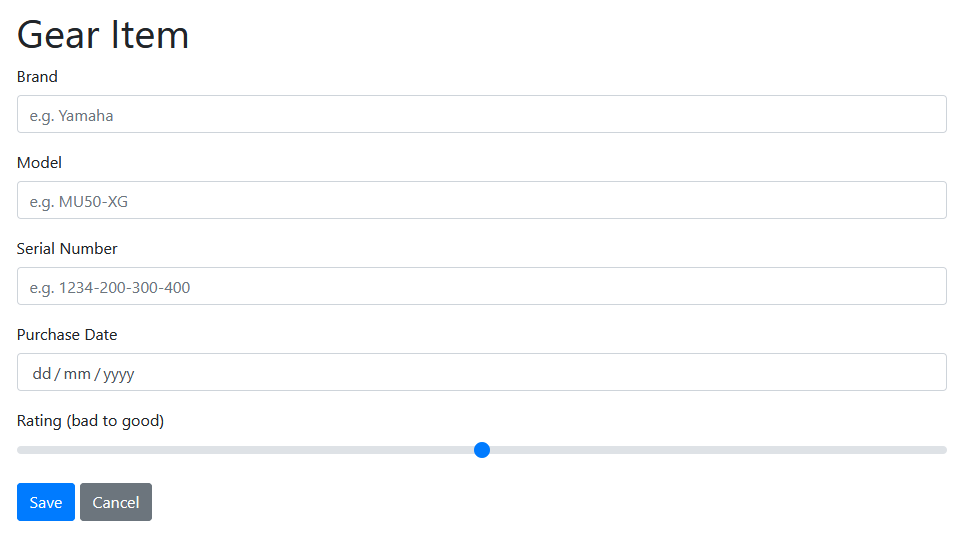

# Formaker

## Introduction

Creating basic HTML forms can be a tedious and repetitive business.
Libraries like Spring Framework are very good at automatic data binding but seem
to lack much in the way of creating markup for run-of-the-mill forms.

Formaker is a library that when given a POJO (with a couple of optional annotations) will
examine the pojo and create a form model (Abstract Form Tree) that may then be rendered
to HTML (or potentially JSON or other representation).

This library is not meant to be a one-stop form building solution, it's for simple every day
forms. You can use as much or as little of Formaker and also combine it with your own
markup where needed.

> Styling: Currently the styling is hardcoded for Bootstrap 4 - I plan to make this more flexible.

## Example Form
 
Here's an example form allowing a user to keep track of musical equipment they've spent all their money on:




```java
package uk.wardm.poc.mykitchensink.model.action;

import lombok.AllArgsConstructor;
import lombok.Data;
import lombok.NoArgsConstructor;
import uk.wardm.formaker.Password;
import uk.wardm.formaker.Range;
import uk.wardm.formaker.TextBox;

import javax.validation.constraints.Max;
import javax.validation.constraints.Min;
import javax.validation.constraints.Size;
import java.time.LocalDate;

@Data
@AllArgsConstructor
@NoArgsConstructor
public class GearItemChange {
    @Size(min = 1, max = 255)
    private String brand;

    @Size(min = 1, max = 255)
    private String model;

    @Size(min = 0, max = 255)
    private String serialNumber;

    private LocalDate purchased;

    @Range @Min(1) @Max(5)
    private Integer rating;
}
```

Add some user defined properties:

```properties

uk.wardm.poc.mykitchensink.model.action.GearItemChange.brand=Brand
uk.wardm.poc.mykitchensink.model.action.GearItemChange.brand.placeholder=e.g. Yamaha

uk.wardm.poc.mykitchensink.model.action.GearItemChange.model=Model
uk.wardm.poc.mykitchensink.model.action.GearItemChange.model.placeholder=e.g. MU50-XG

uk.wardm.poc.mykitchensink.model.action.GearItemChange.serialNumber=Serial Number
uk.wardm.poc.mykitchensink.model.action.GearItemChange.serialNumber.placeholder=e.g. 1234-200-300-400

uk.wardm.poc.mykitchensink.model.action.GearItemChange.purchased=Purchase Date
uk.wardm.poc.mykitchensink.model.action.GearItemChange.purchased.placeholder=23/11/2000

uk.wardm.poc.mykitchensink.model.action.GearItemChange.rating=Rating (bad to good)
uk.wardm.poc.mykitchensink.model.action.GearItemChange.rating.placeholder=1-5 star rating

uk.wardm.poc.mykitchensink.model.action.GearItemChange.quantity=Quantity
uk.wardm.poc.mykitchensink.model.action.GearItemChange.quantity.placeholder=e.g. 1

uk.wardm.poc.mykitchensink.model.action.GearItemChange.secret=Secret
uk.wardm.poc.mykitchensink.model.action.GearItemChange.secret.placeholder=Super secret password

uk.wardm.poc.mykitchensink.model.action.GearItemChange.notes=Notes
uk.wardm.poc.mykitchensink.model.action.GearItemChange.notes.placeholder=Anything you like
```

Define a Thymeleaf template:
```html
<!DOCTYPE html>
<html xmlns:th="http://www.thymeleaf.org"
      xmlns:fm="http://www.wardm.uk/fm">
    <head th:replace="layout::html-head(~{::title})">
        <title>Add Gear Item</title>
    </head>

    <body th:replace="layout::body(~{::main})">
        <main>
            <h1>Gear Item</h1>
            <form action="#" th:object="${form}" th:action="@{/gear/edit(id=${gearId})}" method="post">
                <fm:form-fields fm:form="${form}"/>
                <div>
                    <input class="btn btn-primary" type="submit" value="Save">
                    <a th:href="@{/gear}" class="btn btn-secondary">Cancel</a>
                </div>
            </form>
        </main>
    </body>
</html>
```

The key here is this line:

```html
<fm:form-fields fm:form="${form}"/>
```

## Installation and Setup

> The library is not yet in Maven Central. The way to use it at the moment is to
> clone the repository and then `mvn install` it - this makes it available to your project.
> I hope to change this soon.

The easiest way to use the library is from maven or gradle:

```xml
<dependency>
    <groupId>uk.wardm.formaker</groupId>
    <artifactId>formaker</artifactId>
    <version>1.0-SNAPSHOT</version>
</dependency>
```

You will need to register the Thymeleaf dialect:

```java
@Configuration
public class MvcConfig implements WebMvcConfigurer {
    // ... other config ...
    @Bean
    public FOMDialect formObjectModelDialect() {
        return new FOMDialect();
    }
}
```

You should then be able to use it. Note that for the LocalDate support to work, you
need a suitable date formatter (TODO: expand on this)

