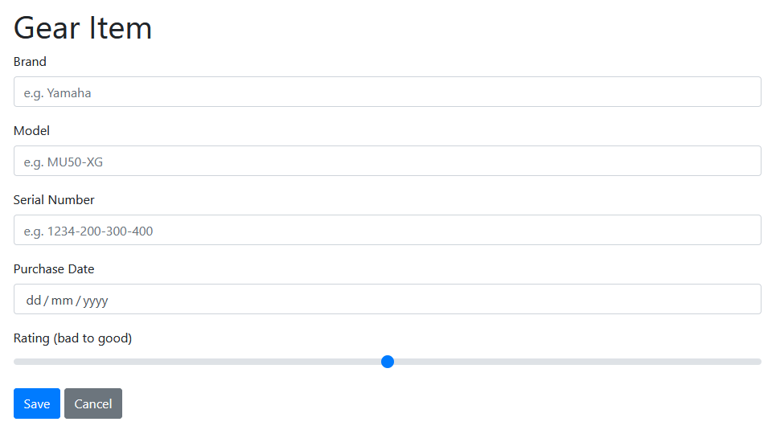

[](https://search.maven.org/search?q=g:%22uk.wardm%22%20AND%20a:%22formaker%22)

# Formaker

## Introduction

Creating basic HTML forms can be a tedious and repetitive business.
Libraries like Spring Framework are very good at automatic data binding but seem
to lack much in the way of creating markup for run-of-the-mill forms.

Formaker is a library that when given a POJO (with a couple of optional annotations) will
examine the pojo and create a form model (Abstract Form Tree) that may then be rendered
to HTML (or potentially JSON or other representation).

This library is not meant to be a one-stop form building solution, it's for simple every day
forms. You can use as much or as little of Formaker and also combine it with your own
markup where needed.

> Styling: Currently the styling is hardcoded for Bootstrap 4 - I plan to make this more flexible.

## License

Formaker is Open Source Software released under the MIT License. See the _LICENSE_ file for details.

## Example Form
 
Here's an example form allowing a user to keep track of musical equipment they've spent all their money on:



To create a form like this, firstly create your Form Backing Bean:

```java
package uk.wardm.poc.mykitchensink.model.action;

import uk.wardm.formaker.annotation.Range;

import javax.validation.constraints.Max;
import javax.validation.constraints.Min;
import javax.validation.constraints.Size;
import java.time.LocalDate;

public class GearItemChange {
    @Size(min = 1, max = 255)
    private String brand;

    @Size(min = 1, max = 255)
    private String model;

    @Size(min = 0, max = 255)
    private String serialNumber;

    private LocalDate purchased;

    @Range @Min(1) @Max(5)
    private Integer rating;
    
    // ... setters, getters etc. ...

}
```

Add some user defined properties:

messages.properties
```properties
brand=Brand
brand.placeholder=e.g. Yamaha

# Fully qualified message keys (below) will take precedence over short keys (above)
uk.wardm.poc.mykitchensink.model.action.GearItemChange.model=Model
uk.wardm.poc.mykitchensink.model.action.GearItemChange.model.placeholder=e.g. MU50-XG
```

Define a Thymeleaf template:
```html
<h1>Gear Item</h1>
<form action="#" th:object="${form}" th:action="@{/gear/edit(id=${gearId})}" method="post">
    <fm:form-fields fm:form="${form}"/>
    <div>
        <input class="btn btn-primary" type="submit" value="Save">
        <a th:href="@{/gear}" class="btn btn-secondary">Cancel</a>
    </div>
</form>
```

The key here is this line:

```html
<fm:form-fields fm:form="${form}"/>
```

This expands to the full list of supported fields on the form.


## Demo

You can run the demo from within the test source tree, by executing the maven command:

```bash
mvn exec:java -Dexec.mainClass=uk.wardm.livetest.TestHarnessApp -Dexec.classpathScope=test
```

You may also run the demo from your favourite IDE, by running the main class `TestHarnessApp`.

When the demo is running, you'll be able to use it with your browser at http://localhost:8080/


## Installation and Setup

> **WARNING:** This is alpha software, and as such should not be used on production systems.

The easiest way to use the library is from maven or gradle:

```xml
<dependency>
  <groupId>uk.wardm</groupId>
  <artifactId>formaker</artifactId>
  <version>1.0-alpha</version>
</dependency>
```


You will need to register the Thymeleaf dialect:

```java
@Configuration
public class MvcConfig implements WebMvcConfigurer {
    // ... other config ...
    @Bean
    public FormakerDialect formObjectModelDialect() {
        return new FormakerDialect();
    }
}
```

You should then be able to use it. Note that for the LocalDate support to work, you
need a suitable date formatter - one is included and configured in with the demo (see above).


